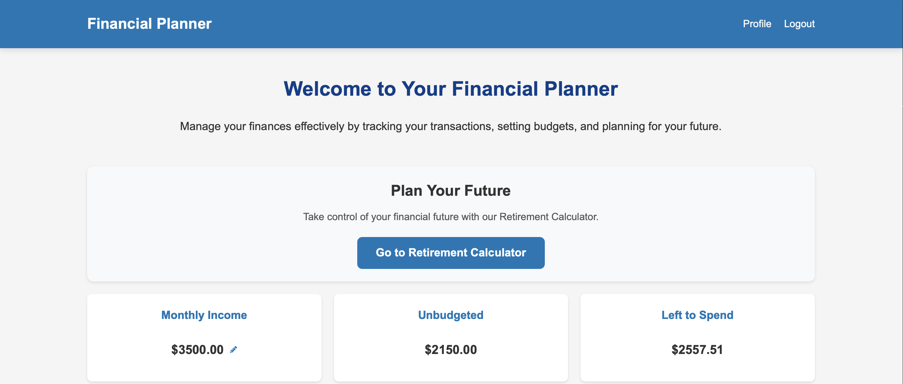

# Financial Planner
A full-stack web app for tracking budgets and transactions. Also includes a retirement savings projection.

This project began as my university capstone, but recently I have made it live and begun to work on it again.

Website is live here: https://financial-planner-production-e6cc.up.railway.app 

Login with guest username `guest@gmail.com` and password `guestaccount`

## Dashboard


## Budget Screen


## How to download and run locally (MacOS):
1. Requires node.js and MySQL.
2. `npm install` in the root folder installs the dependencies.
3. Then run `mysql -u root -p -e "CREATE DATABASE financial_planner;"` and `mysql -u root -p financial_planner < schema.sql` to populate the database with the correct schema.
4. Copy this into a file named `.env`. Replace the two bracketed values with your own, the rest are fine as-is for local development.
```sh
DB_HOST=localhost
DB_USER=root
DB_PASSWORD=<your_mysql_password>
DB_NAME=financial_planner
SESSION_SECRET=<any_long_random_string>
PORT=3000
NODE_ENV=development
```
5. Run `npm start`
6. Go to http://localhost:3000 and the website should be working!

If you have any issues running this please let me know and I can update the readme with better instructions.